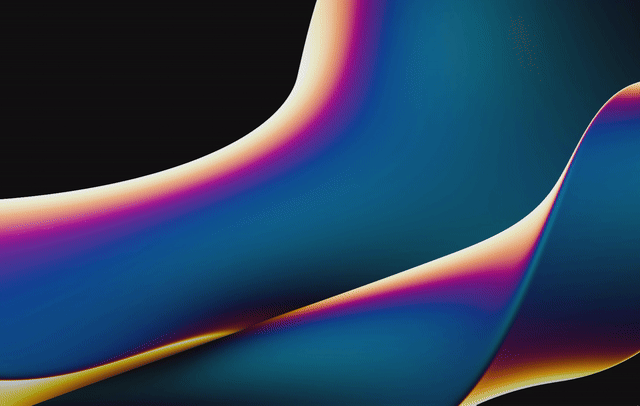

<div align="center">


# RadiAll

**Hold a key, flick at an icon, let go. That's the whole launcher.**

A radial app launcher, window switcher, and per-window action menu for Linux.
One standalone Rust binary, rendered with [Slint](https://slint.dev) — no
shell framework, no QML runtime, no Python. Runs on Hyprland, sway and other
wlroots compositors, KDE (Wayland & X11), GNOME, and every X11 desktop;
Windows and macOS ports are on the roadmap.

<p>
  <a href="LICENSE"></a>
  
  
  
</p>



</div>

---

I've always liked the pie menus from old games, and the radial launchers other
desktops get to have. So I built one: no search box, no typing, no window
grabbing focus you never gave it. You press a key, a ring fans out, you throw
the cursor at what you want. Muscle memory takes over after a day or two.

Three rings, each on its own shortcut:

- **Apps** (`Super + A`) opens the ones you actually use. The dots under an icon are its open windows.
- **Windows** (`Super + W`) shows everything that's open, grouped by app.
- **Focus actions** (`Super + D`) wraps the current window in its own pie: close, float, fullscreen, its `.desktop` entries, and any key-combos you wire up.

All of it is set up from inside the launcher. No dotfile spelunking, no reload.

## The rings, and everything around them

- **Apps ring** — your pinned apps; click to focus-or-launch, right-click to force a new instance, scroll on a multi-window app to pick which window you land on.
- **Windows ring** — every open window, grouped by app.
- **Focus actions** — close / float / fullscreen, the app's own `.desktop` actions, plus custom key-combo shortcuts sent straight to that window. Custom actions get real icons: a built-in picker searches your glyph library (drop SVG sets into `~/.config/radiall/icons/`; a previous RadiAll install's ~24k material-symbols/tabler/lucide icons are picked up automatically).
- **Long-press** an app in the Apps ring and its action arc opens right where it sits.
- **Follow-cursor mode** — the accent sector tracks your mouse across the whole screen, not just on the ring.
- **Theming that goes deep** — 11 bundled themes (catppuccin, nord, gruvbox, dracula, tokyo-night, rose-pine, a phosphor-green `matrix` cell-shade, …). Every surface is a JSON key: band, wedge, backdrop, label pill, action arc, dots, outline. The wheel's sections are fully parametric — corner radius for active and inactive sections, edge padding, angular gaps, and an inactive-section fill for a segmented-pie look. Themes can `extends` each other, the active theme file **hot-reloads while the ring is open**, and "Save as theme" snapshots your current look from the settings UI. See [themes/README.md](themes/README.md).
- **Per-app accents** — give an app its own colour and the hover wedge + window dots follow it.
- **Icons that don't look broken** — RadiAll digs the right icon out of your `.desktop` files and icon theme; when an app genuinely ships none it draws a clean monogram instead of a missing-texture square.
- **Tray icon** — open any ring or Settings from the system tray (StatusNotifierItem, built in — no helper process).

## Getting started

You need a Rust toolchain (`rustup.rs`) and a C compiler. Then:

```sh
git clone https://github.com/Osyna/RadiAll
cd RadiAll
./install.sh
```

The installer builds the release binary, drops it in `~/.local/bin/radiall`,
and on Hyprland wires up autostart plus `Super + A/W/D` (backup of your
`hyprland.conf` kept). Then press `Super + A`.

**On GNOME / KDE / sway / anything else:** autostart `radiall --daemon`, and
bind keys to the CLI — it reaches the running daemon over a socket:

```
radiall --apps       # app ring
radiall --windows    # open-windows ring
radiall --actions    # focused-window actions ring
```

- GNOME: Settings → Keyboard → Custom Shortcuts
- KDE: System Settings → Shortcuts → Add Command
- sway: `bindsym $mod+a exec radiall --apps`

## Using it

- Press a ring's shortcut, flick the cursor at a slice, click it (or press the shortcut again to dismiss).
- Click the middle hole, or hit `Esc`, to dismiss.
- Hover the middle for two seconds to bring up Settings (the radish).
- Long-press an app for its action arc.
- Scroll on a multi-window app to choose the window you want.

## Uninstall

```sh
./install.sh --uninstall
```

Stops the daemon and removes the binary and Hyprland wiring (backup kept).
Your apps, settings, and themes stay put in `~/.config/radiall/`.

## How it works

One binary, two jobs. `radiall --daemon` scans your `.desktop` entries, talks
to the compositor, and draws a transparent screen-covering overlay with Slint
when a ring opens. `radiall --apps` (and friends) poke the daemon over a unix
socket — that's why any DE that can bind a key to a command can drive it.

Compositor integration is an adapter behind one trait, picked automatically
per session:

| Backend | Window list | Focus/close/fullscreen | Float | Send-keys |
|---|---|---|---|---|
| Hyprland (IPC) | ✓ | ✓ | ✓ | ✓ |
| wlroots (`wlr-foreign-toplevel`) — sway, river, Wayfire, labwc… | ✓ | ✓ | — | — |
| KDE Plasma Wayland (`plasma-window-management`) | ✓ | ✓ | — | — |
| Any X11 WM (EWMH) — KDE-X11, XFCE, Cinnamon, MATE, i3, GNOME-X11… | ✓ | ✓ | — | — |
| GNOME Wayland | — | — | — | — |

Global shortcuts pick a provider the same way: **hyprctl** binds on Hyprland,
the **XDG global-shortcuts portal** on GNOME / KDE Wayland (your desktop may
ask once to confirm), **X11 key grabs** on any X11 desktop. No provider?
Bind `radiall --apps` to a key yourself — the CLI reaches the daemon anywhere.

Where the compositor offers nothing (GNOME Wayland has no window-listing
protocol), the apps ring still works fully — the windows/actions rings degrade
gracefully. On Hyprland the overlay is a floating pinned window sized by
window rules; elsewhere it falls back to a fullscreen surface.

### Resource footprint

The daemon idles at ~28 MB RSS with **zero** CPU wakeups until a ring opens;
the GPU renderer (femtovg) then keeps a GL context alive for instant opens —
on some drivers (NVIDIA) that maps large shared driver libraries. RAM-tight
or GPU-less? `RADIALL_RENDERER=software radiall --daemon` renders on CPU:
no GL stack at all, roughly half the exercised footprint, same visuals.

State is JSON in `~/.config/radiall/` (`settings.json`, `apps.json`,
`themes/*.json`), easy to read and commit. Configs from the old
Quickshell-based RadiAll are migrated automatically on first run.

### Changes from the Quickshell version

- Standalone binary — Quickshell, QML, and the Python tray helper are gone.
- Config moved out of the app dir to `~/.config/radiall/`, so uninstalling
  can't eat your settings anymore.
- Hyprland binds use plain `exec, radiall --apps` lines — same file
  (`~/.config/hypr/launcher-binds.conf`), still managed from the settings UI.
- The ring shows on the active output (the old one drew on every monitor).
- Live window thumbnails (off by default upstream) are not ported; the label
  shows the window title instead.

## Thanks, and where the idea came from

**[Slint](https://slint.dev)** renders the whole UI, tray icon included.
The first version of RadiAll was a [Quickshell](https://quickshell.org)
config, and this rewrite reproduces its behavior nearly 1:1 — thanks to
outfoxxed and everyone building Quickshell for making the original possible.

The concept is borrowed, fondly, from the radial launchers I wished Linux had:

- **[Splat — Radial Launcher](https://radial.appverge.net/)**, which nailed the flick-at-an-icon feel.
- **Radial Menu by Frolt Software**, for showing how good a per-window action pie can be.

If you rice this into something nice, I'd genuinely love to see it on r/unixporn.
Screenshots, themes, and PRs are all welcome.

## License

MIT. See [LICENSE](LICENSE).
