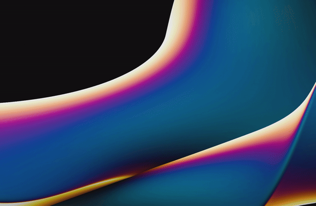
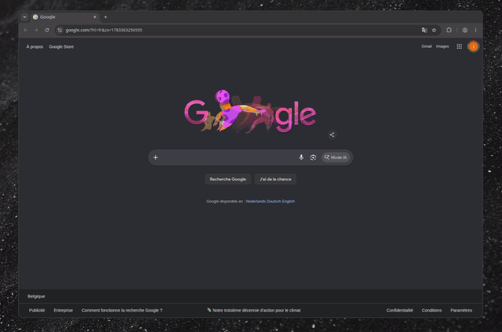
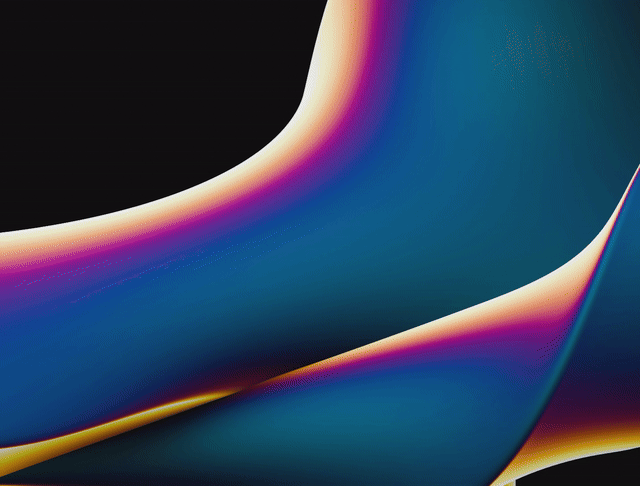
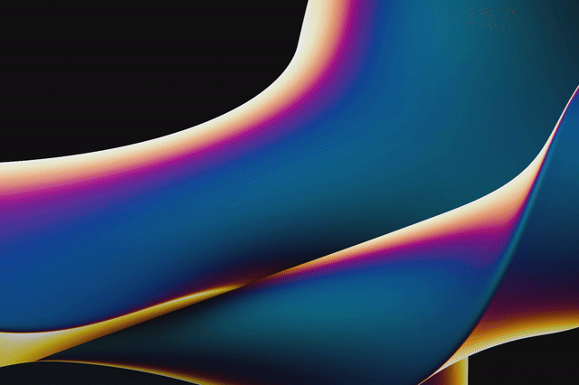

<div align="center">


# RadiAll

**Hold a key, flick at an icon, let go. That's the whole launcher.**

A radial app launcher, window switcher, and per-window action menu for Wayland,
built on [Quickshell](https://quickshell.org). Hyprland-first, happy on any
wlroots compositor.

<p>
  <a href="LICENSE"></a>
  <a href="https://quickshell.org"></a>
  
  
</p>


</div>

---

I've always liked the pie menus from old games, and the radial launchers other
desktops get to have (Splat, Frolt's Radial Menu). Wayland didn't really have
one, so I built it for my own Hyprland rice. No search box, no typing, no window
grabbing focus you never gave it. You hold a key, a ring fans out, you throw the
cursor at what you want. Muscle memory takes over after a day or two.

Three rings, each on its own shortcut:

- **Apps** (`Super + A`) opens the ones you actually use. The dots under an icon are its open windows.
- **Windows** (`Super + W`) shows everything that's open, grouped by app.
- **Focus actions** (`Super + D`) wraps the current window in its own pie: close, float, fullscreen, its `.desktop` entries, and any key-combos you wire up.

All of it is set up from inside the launcher. No dotfile spelunking, no reload.

## The rings, and everything around them

<table>
<tr>
<td width="50%" valign="middle">

### Windows ring

Every open window on one ring, grouped by app. Scroll on an app that has several
windows to pick which one you land on, with a live thumbnail of what you're
about to jump to.

</td>
<td width="50%"></td>
</tr>

<tr>
<td width="50%" valign="middle">

### Actions, in motion

Long-press an app in the Apps ring and its action arc opens right where it sits.
Fire one and the ring gets out of the way on its own.

</td>
<td width="50%"></td>
</tr>

<tr>
<td width="50%" valign="middle">

### Roll your own actions

Give any app a custom action with its own icon and colour, bound to a key-combo
that gets sent straight to that window. Good for the app shortcuts you can never
remember.

</td>
<td width="50%"></td>
</tr>

<tr>
<td width="50%" valign="middle">

### Add apps from the ring

Pull from your installed apps or add one by hand, right in Settings. Nothing to
hand-edit.

</td>
<td width="50%"></td>
</tr>

<tr>
<td width="50%" valign="middle">

### Theme it

Colours, ring and icon size, dim, opacity, follow-cursor, keybinds. Change a
value and the ring updates as you look at it. Themes are plain JSON, so they
drop straight into your dotfiles.

</td>
<td width="50%"></td>
</tr>
</table>

A few things that didn't need their own GIF:

- **Follow-cursor mode**: the accent sector tracks your mouse across the whole screen, not just on the ring.
- **Icons that don't look broken**: RadiAll digs the right icon out of your `.desktop` files, and when an app genuinely ships none it draws a clean glyph instead of a missing-texture square.
- **Keybinds you can switch off**: if `Super + A/W/D` clash with your setup, turn the shortcuts off and open rings from the tray or your own `radiall --apps` bind.
- **Tray icon**: open any ring or Settings from the system tray. Optional, needs `python-gobject` + `libappindicator-gtk3`.

## Getting started

You need **Quickshell** (`qs`). That's the only hard dependency. On Hyprland you
get the full ride, keybinds wired up for you; on other wlroots compositors it
still works, you just bind the keys yourself.

```sh
git clone https://github.com/Osyna/RadiAll
cd RadiAll
./install.sh
```

The installer drops a self-contained config in `~/.config/quickshell/radiall/`
and runs it as its own Quickshell instance, so it leaves any shell you're already
running alone. On Hyprland it also seeds `Super + A/W/D` and links itself into
`hyprland.conf` (backup kept). Then press `Super + A`.

Already run your own Quickshell shell? RadiAll is a normal config, so you can
instead drop `launcher/` and the `Launcher` / `Skin` / `Compositor` singletons
into your setup and add a `RadialMenu {}` next to your bar. That's how I run it.

## Using it

- Hold a ring's shortcut, flick the cursor at a slice, let go (or click it).
- Click the middle hole, or hit `Esc`, to dismiss.
- Hover the middle for two seconds to bring up Settings (the radish).
- Long-press an app for its action arc.
- Scroll on a multi-window app to choose the window you want.

## Uninstall

```sh
./install.sh --uninstall
```

Stops every RadiAll instance and its tray, unlinks itself from `hyprland.conf`
(backup kept), and removes the config. Your saved apps and settings stay put
unless you delete them.

## How it works

Nothing exotic, it's a plain Quickshell config. `shell.qml` registers the ring
shortcuts, draws a transparent layer-shell overlay on every screen, and starts
the tray helper. Window data comes from Hyprland's IPC when you're on Hyprland
and from the generic wlr-foreign-toplevel protocol everywhere else, so the same
code runs on sway, river, Wayfire, and the rest. State is JSON in
`~/.config/quickshell/radiall/`, easy to read and commit.

## Thanks, and where the idea came from

**[Quickshell](https://quickshell.org)** does the heavy lifting here: the
layer-shell surfaces, the Hyprland and Wayland plumbing, the icon and
desktop-entry lookups, the whole runtime. RadiAll is really just a QML config
sitting on top of it. Big thanks to outfoxxed and everyone building Quickshell,
go give it a star.

The concept is borrowed, fondly, from the radial launchers I wished Wayland had:

- **[Splat — Radial Launcher](https://radial.appverge.net/)**, which nailed the flick-at-an-icon feel.
- **Radial Menu by Frolt Software**, for showing how good a per-window action pie can be.

If you rice this into something nice, I'd genuinely love to see it on r/unixporn.
Screenshots, themes, and PRs are all welcome.

## License

MIT. See [LICENSE](LICENSE).
